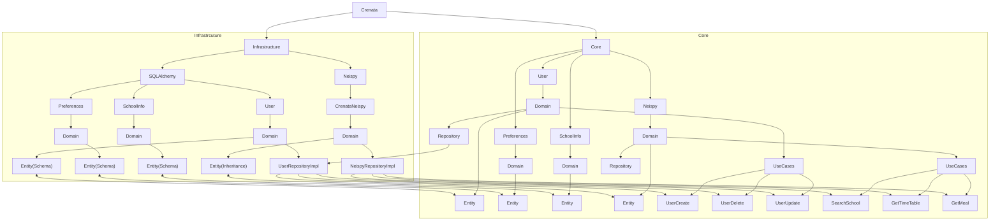

# 🌲 Crenata

Crenata는 모든 학생이 편한 학교생활을 경험할 수 있는 것을 목표로 하는 오픈소스 프로젝트 디스코드 봇입니다.

소스의 문서는 [docs/README.md](docs/README.md)를 참고해주세요.

```mermaid
graph TD
	
	Crenata --> Core & Infrastructure

	subgraph CoreGraph[Core]
	Core --> User & Preferences & SchoolInfo & Neispy
	User --> UserDomain[Domain]
	Preferences --> PreferencesDomain[Domain]
	SchoolInfo --> SchoolInfoDomain[Domain]
	Neispy --> CrenataNeispyDomain[Domain]

	UserDomain --> UserEntity[Entity] & UserRepository[Repository] & UserUseCase[UseCases]
	PreferencesDomain --> PreferencesEntity[Entity]
	SchoolInfoDomain --> SchoolInfoEntity[Entity]
	CrenataNeispyDomain --> CrenataNeispyEntity[Entity] & CrenataNeispyRepository[Repository] & CrenataNeispyUseCase[UseCases]

	UserUseCase --> UserCreate & UserDelete & UserUpdate
	CrenataNeispyUseCase --> SearchSchool & GetTimeTable & GetMeal
	end

	subgraph InfrastrctureGraph[Infrastrcuture]
	Infrastructure --> InfraNeispy[Neispy] --> InfraCrenataNeispy[CrenataNeispy]
	Infrastructure --> SQLAlchemy --> InfraUser[User] & InfraPreferences[Preferences] & InfraSchoolInfo[SchoolInfo]

	InfraUser --> InfraUserDomain[Domain]
	InfraPreferences --> InfraPreferencesDomain[Domain]
	InfraSchoolInfo --> InfraSchoolInfoDomain[Domain]
	InfraCrenataNeispy --> InfraCrenataNeispyDomain[Domain]

	InfraUserDomain --> InfraUserEntity["Entity(Schema)"]
	InfraPreferencesDomain --> InfraPreferencesEntity["Entity(Schema)"]
	InfraSchoolInfoDomain --> InfraSchoolInfoEntity["Entity(Schema)"]
	InfraCrenataNeispyDomain --> InfraCrenataNeispyEntity["Entity(Inheritance)"]
	
	InfraUserDomain --> InfraUserRepository[UserRepositoryImpl]
	InfraCrenataNeispyDomain --> InfraCrenataNeispyRepository[NeispyRepositoryImpl]
	
	InfraUserEntity <--> UserEntity

	InfraPreferencesEntity <--> PreferencesEntity

	InfraSchoolInfoEntity <--> SchoolInfoEntity

	InfraCrenataNeispyEntity <--> CrenataNeispyEntity

	UserRepository --> InfraUserRepository

	InfraUserRepository --> UserCreate & UserUpdate & UserDelete

	InfraCrenataNeispyRepository --> SearchSchool & GetTimeTable & GetMeal
	end
```
